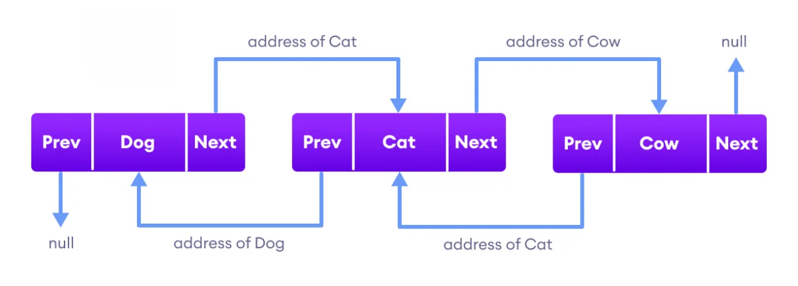

## 1. Java list

요소를 순차적으로 저장하고 중복을 허용하는 데이터 집합입니다. java.util 패키지 내부에 있고, Collection 인터페이스의 하위 인터페이스입니다.

<br>

## 2. List 종류

### 2.1 ArrayList

ArrayList는 배열을 기반으로 만들어진 자료구조입니다. 배열은 크기가 고정이지만, ArrayList는 동적으로 늘릴 수 있습니다.

검색을 할 경우 인덱스로 조회하기 때문에 속도가 빠릅니다.
<br>
데이터 추가, 삭제를 할 경우 이후의 데이터를 복사 후 재정렬하기 때문에 빈번한 추가, 삭제에는 부적합합니다.

<br>

#### Capacity

내부적으로 저장이 가능한 메모리 용량(Capacity)이 있으며 현재 사용 중인 공간의 크기(Size)가 있습니다.
<br>
인스턴스의 capacity 값 이상을 저장하려고 할 때 더 큰 공간의 메모리를 새롭게 할당합니다.
<br>

ArrayList 코드를 보면서 어떻게 구성되었고 동작하는지 확인해보겠습니다.

```java

    ...

    private static final int DEFAULT_CAPACITY = 10;
    private static final Object[] DEFAULTCAPACITY_EMPTY_ELEMENTDATA = {};
    transient Object[] elementData; // non-private to simplify nested class access

    public ArrayList(int initialCapacity) {
        if (initialCapacity > 0) {
            this.elementData = new Object[initialCapacity];
        } else if (initialCapacity == 0) {
            this.elementData = EMPTY_ELEMENTDATA;
        } else {
            throw new IllegalArgumentException("Illegal Capacity: "+
                                               initialCapacity);
        }
    }

    ...
```

기본 가용량(DEFAULT_CAPACITY)은 10으로 설정되어 있습니다. ArrayList 가 생성될 때 가용량이 설정된다는 것을 확인할 수 있습니다. 설정한 가용량만큼의 길이를 가지는 객체를 생성 후 ArrayList 인스턴스의 `elementData` 에 할당합니다.

<br>

```java
    ...
    public void add(int index, E element) {
        rangeCheckForAdd(index);
        modCount++;
        final int s;
        Object[] elementData;
        if ((s = size) == (elementData = this.elementData).length)
            elementData = grow();
        System.arraycopy(elementData, index,
                         elementData, index + 1,
                         s - index);
        elementData[index] = element;
        size = s + 1;
    }

    public boolean addAll(Collection<? extends E> c) {
        Object[] a = c.toArray();
        modCount++;
        int numNew = a.length;
        if (numNew == 0)
            return false;
        Object[] elementData;
        final int s;
        if (numNew > (elementData = this.elementData).length - (s = size))
            elementData = grow(s + numNew);
        System.arraycopy(a, 0, elementData, s, numNew);
        size = s + numNew;
        return true;
    }
    ...
```

요소를 추가하는 add(), addAll() 메서드입니다.

add() 메서드를 호출할 경우 **리스트의 길이와 가용량이 같다면** grow() 메서드 호출합니다.

addAll() 메서드를 호출할 경우 **추가하려는 리스트의 길이가 (가용량 - Size) 보다 크다면** grow() 메서드 호출합니다.

ex) 리스트의 길이: 8 / 가용량: 10 / 추가하려는 리스트 길이: 3 <br>
3 > 10 - 8 이므로 grow() 메서드를 호출합니다.

<br>

```java
    ...
    private Object[] grow(int minCapacity) {
        int oldCapacity = elementData.length;
        if (oldCapacity > 0 || elementData != DEFAULTCAPACITY_EMPTY_ELEMENTDATA) {
            int newCapacity = ArraysSupport.newLength(oldCapacity,
                    minCapacity - oldCapacity, /* minimum growth */
                    oldCapacity >> 1           /* preferred growth */);
            return elementData = Arrays.copyOf(elementData, newCapacity);
        } else {
            return elementData = new Object[Math.max(DEFAULT_CAPACITY, minCapacity)];
        }
    }
    ...
```

List의 크기를 늘릴 때 호출하는 `grow()` 메서드입니다.

`Arrays.copyOf()` 메서드를 사용하여 기존의 요소를 복사하고 `ArraysSupport.newLength()` 메서드를 통해 반환된 크기만큼 List의 크기를 증가시킵니다.

<br>

#### 예제

```java
		List<String> list = new ArrayList<>();

		list.add("ballad");
		list.add("pop");
		list.add("k-pop");
		list.add("ballad");

		System.out.println("list = " + list);

		// Set
		list.add(4, "classic");
		list.set(4, "rap");

		System.out.println("Set list = " + list);

		// Remove
		list.remove(0);
		list.remove("k-pop");

		System.out.println("Removed list = " + list);

		// Iterator
		System.out.println();
		System.out.println("---------Iterator---------");

		Iterator<String> iterator = list.iterator();
		while (iterator.hasNext()) {
			System.out.println("next = " + iterator.next());
		}

		ListIterator<String> listIterator = list.listIterator(list.size());
		while (listIterator.hasPrevious()) {
			System.out.println("previous = " + listIterator.previous());
		}
```

Output

```java
list = [ballad, pop, k-pop, ballad]
Set list = [ballad, pop, k-pop, ballad, rap]
Removed list = [pop, ballad, rap]

---------Iterator---------
next = pop
next = ballad
next = rap
previous = rap
previous = ballad
previous = pop
```

데이터를 순회할 때 for-each 문을 사용할 수도 있고, Iterator, ListIterator를 사용할 수도 있습니다.
`hasPrevious()`, `hasNext()` 메서드를 사용하여 요소가 존재하면 이전, 다음 요소를 가져옵니다.

<br>

### 2.2 LinkedList



양방향 포인터 구조로 되어 있고, 데이터와 포인터를 가진 노드들이 선처럼 연결되어 저장되는 자료구조입니다.
<br>
LinkedList는 DoublyLinkedList 로 구현되어 있어 각 노드들은 `prev`, `next` 값을 내부적으로 가지고 있고 양방향으로 참조가 가능합니다.

<br>

LinkedList 내부의 Node 클래스

```java
    private static class Node<E> {
        E item;
        Node<E> next;
        Node<E> prev;

        Node(Node<E> prev, E element, Node<E> next) {
            this.item = element;
            this.next = next;
            this.prev = prev;
        }
    }
```

- Prev - 목록에서 이전 요소의 주소를 저장합니다.
- Next - 목록에서 다음 요소의 주소를 저장합니다.
- Data - 실제 데이터를 저장합니다.

<br>

검색을 할 경우 참조 순환으로 조회를 하기 때문에 속도가 오래 걸립니다.<br>
데이터 추가, 삭제를 할 경우 참조하는 포인터 값만 바꾸면 되기 때문에 속도가 빠릅니다.

<br>

#### 예제

```java
		LinkedList<String> list = new LinkedList<>();

		list.add("ballad");
		list.add("pop");
		list.add("k-pop");
		list.add("ballad");

		System.out.println("list = " + list);

		// Set
		list.add(4, "classic");
		list.set(4, "rap");

		System.out.println("Set list = " + list);

		// Remove
		list.remove(0);
		list.remove("k-pop");

		System.out.println("Removed list = " + list);

		// Iterator
		System.out.println();
		System.out.println("---------Iterator---------");

		Iterator<String> iterator = list.iterator();
		while (iterator.hasNext()) {
			System.out.println("next = " + iterator.next());
		}

		ListIterator<String> listIterator = list.listIterator(list.size());
		while (listIterator.hasPrevious()) {
			System.out.println("previous = " + listIterator.previous());
		}

		// peek, poll
		System.out.println();
		System.out.println("---------peek and poll---------");

		String peek = list.peek();
		System.out.println("peek = " + peek);
		System.out.println("list = " + list);

		String poll = list.poll();
		System.out.println("poll = " + poll);
		System.out.println("list = " + list);
```

Output

```java
list = [ballad, pop, k-pop, ballad]
Set list = [ballad, pop, k-pop, ballad, rap]
Removed list = [pop, ballad, rap]

---------Iterator---------
next = pop
next = ballad
next = rap
previous = rap
previous = ballad
previous = pop

---------peek and poll---------
peek = pop
list = [pop, ballad, rap]
poll = pop
list = [ballad, rap]
```

<br>

## 📚 참고자료

[[Java] 자바 ArrayList 사용 방법](https://psychoria.tistory.com/765)

[Java LinkedList](https://www.programiz.com/java-programming/linkedlist)

```toc

```
