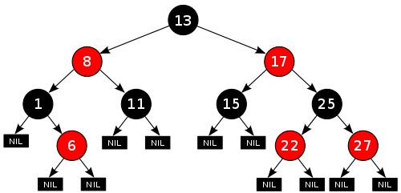

## 1. Java map

Java에서 Map 인터페이스는 java.util 패키지에 있으며 키와 값 간의 매핑을 나타냅니다. Collection 인퍼페이스와는 다른 저장방식을 가집니다.

맵은 사전과 같은 키-값 연결 매핑에 사용하기에 완벽합니다. 맵은 키로 조회를 수행하거나 키로 요소를 검색하고 업데이트하려고 할 때 사용됩니다.

<br>

## 2. Map 특징


1. 맵은 중복 키를 포함할 수 없으며 각 키는 최대 하나의 값에 매핑할 수 있습니다.
2. 저장 순서는 특정 구현에 따라 다릅니다. TreeMap과 LinkedHashMap은 예측 가능한 순서가 있지만, HashMap에는 순서가 없습니다.
3. Java에서 map을 구현하기 위한 두 가지(Map, SortedMap) 인터페이스와 세 가지 클래스(HashMap, TreeMap 및 LinkedHashMap)가 있습니다.

<br />

## 3. Map 종류

### 3.1 HashMap

HashMap은 해싱 기술을 사용합니다. 해싱은 큰 문자열을 동일한 문자열을 나타내는 작은 문자열로 변환하는 기술입니다. HashMap은 빠른 삽입, 검색 및 삭제의 이점은 있지만 삽입 순서를 유지하지 않습니다.

```java
		Map<String, Integer> map = new HashMap<>();

		map.put("pop", 1);
		map.put("ballad", 3);
		map.put("rap", 2);

		for (Map.Entry<String, Integer> e : map.entrySet())

			System.out.println(e.getKey() + " "
					+ e.getValue());
```

Output

```java
pop 1
rap 2
ballad 3
```

<br />

### 3.2 LinkedHashMap

LinkedHashMap은 삽입된 요소의 순서를 유지하는 추가 기능이 있는 HashMap과 같습니다.

```java
		Map<String, Integer> map = new LinkedHashMap<>();

		map.put("pop", 1);
		map.put("ballad", 3);
		map.put("rap", 2);

		for (Map.Entry<String, Integer> e : map.entrySet())

			System.out.println(e.getKey() + " "
					+ e.getValue());
```

Output

```java
pop 1
ballad 3
rap 2
```

<br />

### 3.3 TreeMap

TreeMap은 이진트리(레드-블랙 트리)를 기반으로 한 Map 컬렉션입니다. TreeMap에 객체를 저장하면 자동으로 정렬되는데, 키는 저장과 동시에 자동 오름차순(default)으로 정렬되고 숫자 타입일 경우에는 값으로, 문자열 타입일 경우에는 유니코드로 정렬합니다.

정렬 순서는 기본적으로 부모 키값과 비교해서 키값이 낮은 것인 왼쪽 자식 노드에 키값이 높은 것은 오른쪽 자식 노드에 Map.Entry 객체를 저장합니다. TreeMap은 일반적으로 데이터를 저장할 때 즉시 정렬하기에 추가나 사가제가 HashMap보다 오래 걸립니다. 하지만 정렬된 상태로 Map을 유지해야 하거나 정렬된 데이터를 조회해야 하는 범위 검색이 필요한 경우 TreeMap을 사용하는 것이 효율성면에서 좋습니다.

<br />

#### 레드-블랙 트리(Red-Black Tree)



TreeMap은 이진탐색트리의 문제점을 보완한 레드-블랙 트리로 이루어져 있습니다. 일반적인 이진 탐색 트리는 높이만큼 시간이 필요합니다. 값이 전체 트리에 잘 분산되어 있다면 효율성에 있어 크게 문제가 없으나 데이터가 들어올 때 값이 한 쪽으로 편향되게 들어올 경우 한쪽 방면으로 크게 치우쳐진 트리가 되어 굉장이 비효율적인 퍼포먼스를 냅니다. 이 문제를 보완하기 위해 레드 블랙 트리가 등장하였습니다.

레드 블랙 트리는 부모 노드보다 작은 값을 가지는 노드는 왼쪽 자식으로, 큰 값을 가지는 노드는 오른쪽 자식으로 배치하여 데이터의 추가나 삭제 시 트리아 한쪽으로 치우쳐지지 않도록 균형을 맞추어줍니다.

```java
		Map<String, Integer> map = new TreeMap<>();

		map.put("pop", 1);
		map.put("ballad", 3);
		map.put("rap", 2);

		for (Map.Entry<String, Integer> e : map.entrySet())

			System.out.println(e.getKey() + " "
					+ e.getValue());
```

Output

```java
ballad 3
pop 1
rap 2
```

<br>

### 4. Map 메서드

#### 4.1 put, get

```java
		Map<String, List<Integer>> map = new HashMap<>();

		List<Integer> numList = new ArrayList<>();

		numList.add(1);
		numList.add(2);
		numList.add(3);

		map.put("numList", numList);

		System.out.println(map.get("numList"));
```

Output

```java
[1, 2, 3]
```

<br />

#### 4.2 containsKey

```java
		Map<String, Integer> map = new HashMap<>();

		map.put("pop", 1);
		map.put("ballad", 3);
		map.put("rap", 2);

		System.out.println(map.containsKey("pop"));
```

Output

```java
true
```

<br />

#### 4.3 remove

```java
		Map<String, Integer> map = new HashMap<>();

		map.put("pop", 1);
		map.put("ballad", 3);
		map.put("rap", 2);

		map.remove("ballad");

		for (Map.Entry<String, Integer> e : map.entrySet())

			System.out.println(e.getKey() + " "
					+ e.getValue());
```

Output

```java
pop 1
rap 2
```

<br />

## 📚 참고자료

[Java Map Interface](https://www.geeksforgeeks.org/map-interface-java-examples/)

[Map 이란?](https://devmoony.tistory.com/144)

[[Java] 자바 TreeMap 사용법 & 예제 총정리](https://coding-factory.tistory.com/557)

```toc

```
