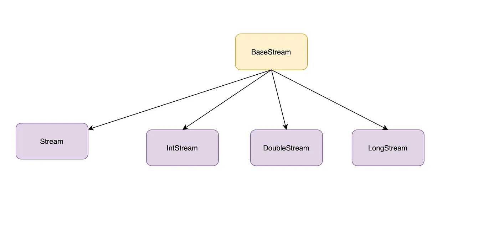

## 1. Java Stream

Java 8부터 컬렉션 및 배열의 요소를 반복처리하기 위해 추가된 기능

<br>

## 2. Stream 특징

1. 내부 반복자이므로 처리 속도가 빠르고 병렬 처리에 효율적이다.
2. 람다식으로 다양한 요소 처리를 정의할 수 있다.
3. 중간 처리와 최종 처리를 수행하도록 파이프 라인을 형성할 수 있다.

<br>

## 3. 중간 처리, 최종 처리

스트림은 중간 처리, 최종 처리 과정을 거친 후에 결과값을 반환합니다.

중간 처리는 요소를 걸러내거나(필터링), 요소를 변환시키거나(매핑), 정렬하는 자업을 수행합니다.
<br>
최종 처리는 중간 처리에서 정제된 요소들을 반복하거나, 집계(카운팅, 총합, 평균) 작업을 수행합니다.

주의할 점은 최종 처리를 꼭 해줘야 한다는 것입니다.
<br>
최종 처리를 하지 않으면 중간처리도 동작하지 않습니다.

예시로 사용할 Student 클래스입니다.

```java
public class Student {
    private String name;
    private int age;

    public Student(String name, int age) {
        this.name = name;
        this.age = age;
    }

    public String getName() {
        return name;
    }

    public int getAge() {
        return age;
    }
}

```

<br>
학생 객체를 나이로 매핑하고(중간처리), 평균 나이를 산출(최종처리)하는 예시입니다.

```java
List<Student> list = Arrays.asList(
		new Student("이강인", 10),
		new Student("추사랑", 12),
		new Student("벤틀리", 8)
);

Stream<Student> studentStream = list.stream();

double avg = studentStream
		.mapToInt(student -> student.getAge())
		.average()
		.getAsDouble();

System.out.println("평균 나이 = " + avg);
```

Output

```java
평균 나이 = 10.0
```

<br>

## 4. 스트림 생성

java.util.stream 패키지에는 스트림 인터페이스들이 있습니다. BaseStream 인터페이스를 부모로 한 자식 인터페이스들은 아래와 같은 상속 관계를 이룹니다.
<br>



`Stream`은 객체 요소를 처리하는 스트림이고 `IntStream`, `DoubleStream`, `LongStream` 은 각각 int, double, long 타입의 요소를 처리하는 스트림입니다.
<br>

따라서 아래처럼 double, int 등을 사용하고 배열, 숫자 범위로도 스트림을 생성할 수 있습니다.

```java
double[] doubleArray = {1.0, 2.0, 3.0};
DoubleStream doubleStream = Arrays.stream(doubleArray);

IntStream intStream = IntStream.rangeClosed(1, 3);
```

<br>

## 5. 중간 처리

### 5.1 필터링

필터링 메서드는 `distinct`, `filter` 가 있습니다.

`filter` 메서드는 `Predicate` 함수형 인터페이스를 매개변수로 사용합니다.<br>
`Predicate는` 매개값을 조사한 후 boolean을 리턴하는 `test` 메서드를 가지고 있습니다.

Predicate<T>를 람다식으로 표현하면 다음과 같습니다.

```java
T -> true;
```

<br>

#### 예시

```java
ArrayList<String> list = new ArrayList<>();

list.add("오펜하이머");
list.add("바비");
list.add("오펜하이머");

List<String> distinctStudent = list.stream()
		.distinct()
		.toList();

System.out.println("distinctStudent = " + distinctStudent);

list.stream()
		.filter(e -> e.equals("바비"))
		.forEach(e -> System.out.println("filtered = " + e));
```

Output

```java
distinctStudent = [오펜하이머, 바비]
filtered = 바비
```

<br>

### 5.2 매핑

매핑은 스트림의 요소를 다른 요소로 변환하는 기능입니다.<br>
매핑 메서드는 `mapXxx`, `asDoubleStream`, `asLongStream`, `boxed`, `flatMapXxx` 등이 있습니다.

매개변수로 `Function` 함수형 인터페이스를 사용합니다. 모든 Function은 매개값을 리턴값으로 매핑하는 `applyXxx` 메서드를 가지고 있습니다.

Function<T, R>을 람다식으로 표현하면 다음과 같습니다.

```java
T -> R;
```

<br>

#### 예시

```java
ArrayList<Student> list = new ArrayList<>();
list.add(new Student("이강인", 10));
list.add(new Student("벤틀리", 8));
list.add(new Student("추사랑", 6));

// obj -> int
list.stream()
		.mapToInt(student -> student.getAge())
		.forEach(age -> System.out.println("age = " + age));

// int -> double
int[] intArray = {1, 2, 3};
IntStream intStream = Arrays.stream(intArray);
intStream.asDoubleStream()
		.forEach(l -> System.out.println("l = " + l));

// int -> object
intStream = Arrays.stream(intArray);
intStream.boxed()
		.forEach(obj -> System.out.println("obj = " + obj.intValue()));

// flatMap은 하나의 요소를 복수 개의 요소들로 변환한 새로운 스트림을 반환
List<String> list1 = new ArrayList<>();
list1.add("김씨의 개발일지");
list1.add("나의 해방일지");
list1.stream()
		.flatMap(s -> Arrays.stream(s.split(" ")))
		.forEach(w -> System.out.println("new Stream = " + w));
```

Output

```java
age = 10
age = 8
age = 6
l = 1.0
l = 2.0
l = 3.0
obj = 1
obj = 2
obj = 3
new Stream = 김씨의
new Stream = 개발일지
new Stream = 나의
new Stream = 해방일지
```

<br>

### 5.3 정렬

`sorted` 메서드를 사용해서 정렬할 수 있습니다.<br>
정렬하려는 요소가 객체일 경우 `Comparable`(`Comparator` 포함)을 구현해야만 `sorted` 메서드를 사용할 수 있습니다.

<br>

#### 예시

```java
public class Student implements Comparable<Student> {
	...

    @Override
    public int compareTo(Student s) {
        return Integer.compare(age, s.age);
    }
}
```

<br>

```java
ArrayList<Student> list = new ArrayList<>();
list.add(new Student("이강인", 10));
list.add(new Student("벤틀리", 8));
list.add(new Student("추사랑", 6));

// 나이 순서로 오름차순
System.out.println("-----오름차순-----");
list.stream()
		.sorted()
		.forEach(s -> System.out.println(s.getName()));

// 나이 순서로 내림차순
System.out.println("-----내림차순-----");
list.stream()
		.sorted(Comparator.reverseOrder())
		.forEach(s -> System.out.println(s.getName()));

// 객체에 Comparable 구현대신 Comparator 사용하는 방법
System.out.println("-----Comparator 내림차순-----");
list.stream()
		.sorted((s1, s2) -> Integer.compare(s2.getAge(), s1.getAge()))
		.forEach(s -> System.out.println(s.getName()));
```

Output

```java
-----오름차순-----
추사랑
벤틀리
이강인
-----내림차순-----
이강인
벤틀리
추사랑
-----Comparator 내림차순-----
이강인
벤틀리
추사랑
```

<br>

### 5.4 루핑

루핑은 스트림에서 요소를 하나씩 반복해서 가져와 처리하는 것을 말합니다. `peek`, `forEach` 메서드가 있습니다.

두 메서드는 동일하게 루핑하지만 `peek은` 중간처리 메서드이고, `forEach` 는 최종 처리 메서드입니다.<Br>
따라서 `peek` 은 최종 처리가 뒤에 붙지 않으면 동작하지 않습니다.

두 메서드는 `Consumer` 를 매개변수로 사용합니다.<br>
`Consumer` 는 함수형 인터페이스이고 매개값을 처리하는 `accept` 메서드를 가지고 있습니다.

람다식으로 표현하면 다음과 같습니다.

```java
T -> 실행문;
```

#### 예시

```java
int[] intArr = {1, 2, 3};

int sum = Arrays.stream(intArr)
		.filter(i -> i % 2 != 0)
		.peek(n -> System.out.println("n = " + n))
		.sum();

System.out.println("sum = " + sum);
```

Output

```java
n = 1
n = 3
sum = 4
```

<br>

## 📚 참고자료

📘 이것이 자바다

```toc

```
