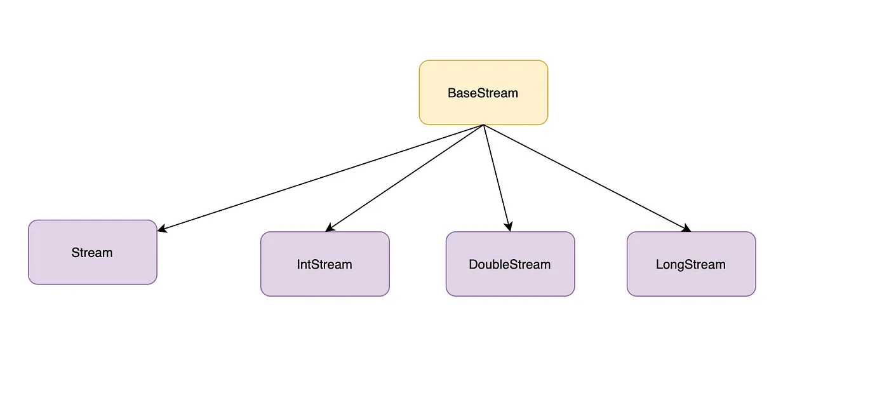

## 1. Java Stream

Java 8부터 컬렉션 및 배열의 요소를 반복처리하기 위해 추가된 기능

<br>

## 2. Stream 특징

1. 내부 반복자이므로 처리 속도가 빠르고 병렬 처리에 효율적이다.
2. 람다식으로 다양한 요소 처리를 정의할 수 있다.
3. 중간 처리와 최종 처리를 수행하도록 파이프 라인을 형성할 수 있다.

<br>

## 3. 중간 처리, 최종 처리

스트림은 중간 처리, 최종 처리 과정을 거친 후에 결과값을 반환합니다.

중간 처리는 요소를 걸러내거나(필터링), 요소를 변환시키거나(매핑), 정렬하는 자업을 수행합니다.
<br>
최종 처리는 중간 처리에서 정제된 요소들을 반복하거나, 집계(카운팅, 총합, 평균) 작업을 수행합니다.

주의할 점은 최종 처리를 꼭 해줘야 한다는 것입니다.
<br>
최종 처리를 하지 않으면 중간처리도 동작하지 않습니다.

예시로 사용할 Student 클래스입니다.

```java
public class Student {
    private String name;
    private int age;

    public Student(String name, int age) {
        this.name = name;
        this.age = age;
    }

    public String getName() {
        return name;
    }

    public int getAge() {
        return age;
    }
}

```

<br>
학생 객체를 나이로 매핑하고(중간처리), 평균 나이를 산출(최종처리)하는 예시입니다.

```java
		List<Student> list = Arrays.asList(
				new Student("이강인", 10),
				new Student("추사랑", 12),
				new Student("벤틀리", 8)
		);

		Stream<Student> studentStream = list.stream();

		double avg = studentStream
				.mapToInt(student -> student.getAge())
				.average()
				.getAsDouble();

		System.out.println("평균 나이 = " + avg);
```

Output

```java
평균 나이 = 10.0
```

<br>

## 4. 스트림 생성

java.util.stream 패키지에는 스트림 인터페이스들이 있습니다. BaseStream 인터페이스를 부모로 한 자식 인터페이스들은 아래와 같은 상속 관계를 이룹니다.
<br>



Stream은 객체 요소를 처리하는 스트림이고 IntStrea, DoubleStream, LongStream 은 각각 int, double, long 타입의 요소를 처리하는 스트림입니다.
<br>

따라서 아래처럼 double, int 등을 사용하고 배열, 숫자 범위로도 스트림을 생성할 수 있습니다.

```java
		double[] doubleArray = {1.0, 2.0, 3.0};
		DoubleStream doubleStream = Arrays.stream(doubleArray);

		IntStream intStream = IntStream.rangeClosed(1, 3);
```

<br>

## 5. 중간 처리

### 5.1 필터링

```java
		ArrayList<String> list = new ArrayList<>();

		list.add("오펜하이머");
		list.add("바비");
		list.add("오펜하이머");

		List<String> distinctStudent = list.stream()
				.distinct()
				.toList();

		System.out.println("distinctStudent = " + distinctStudent);

		list.stream()
				.filter(e -> e.equals("바비"))
				.forEach(e -> System.out.println("filtered = " + e));
```

Output

```java
distinctStudent = [오펜하이머, 바비]
filtered = 바비
```

### 5.2 매핑

### 5.3 정렬

### 5.4 루핑

## 6. 최종 처리

### 6.1 매칭

### 6.2 집계

### 6.3 수집

### 6.4 그룹핑

## 📚 참고자료

📘 이것이 자바다

<!-- [Set in Java](https://www.javatpoint.com/set-in-java) -->

```toc

```
