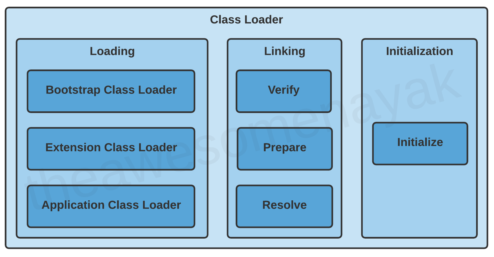

## 1. JVM 이란?

Java 프로그램이 실행되기 위해 필요한 런타임 환경을 제공하는 프로그램입니다.

C와 같은 프로그래밍 언어에서는 코드는 먼저 플랫폼별 기계어로 컴파일됩니다. 이러한 언어를 **컴파일 언어**라고 합니다.

반면 javascript 및 python과 같은 언어에서는 컴퓨터가 코드를 컴파일하지 않고 직접 실행합니다. 이러한 언어를 **인터프리터 언어**라고 합니다.

Java는 두 기술을 조합하여 사용합니다. 소스 코드는 먼저 바이트 코드로 컴파일 되어 클래스 파일을 생성합니다. 이 클래스 파일은 기본 플랫폼에 대한 JVM에 의해 해석됩니다. 모든 플랫폼 및 운영 체제에서 실행되는 모든 버전의 JVM에서 동일한 클래스 파일을 실행할 수 있습니다.
<br />

## 2. JVM의 동작 방식

1. 자바 프로그램을 실행하면 JVM은 OS로부터 메모리를 할당받습니다.
2. 자바 컴파일러가 자바 소스코드를 자바 바이트 코드로 컴파일 합니다.
3. Class Loader는 동적 로딩을 통해 필요한 클래스들을 로딩 및 링크하여 Runtime Data Area에 올립니다.
4. Runtime Data Area에 로딩 된 바이트 코드는 Execution engine을 통해 번역되고 실행됩니다.
5. 이 과정에서 Execution engine에 의해 GC의 작동돠 Thread 동기화가 이루어집니다.

<br />

## 3. JVM의 내부 구조


### 3.1 Class Loader



클래스 로더는 JVM 내로 클래스 파일을 동적으로 로드하고, 링크를 통해 배치하는 작업을 수행하는 모듈입니다.

즉, 로드된 바이트 코드들을 엮어서 JVM의 메모리 영역인 Runtime Data Area 에 배치합니다.

클래스를 메모리에 올리는 로딩 기능은 한번에 메모리에 올리지 않고, 어플리케이션에서 필요한 경우 동적으로 메모리에 적재하게 됩니다. (java의 장점)

클래스 파일의 로딩은 Loading -> Linking -> Initialization 순서로 진행됩니다.
<br />

#### 3.1.1 Loading

클래스 파일을 가져와서 JVM의 메모리에 로드합니다.
Java에서 사용할 수 있는 세 가지 내장 클래스 로더가 있습니다.

##### Bootstrap Class Loader

java.lang, java.net, java.util, java.io 등과 같은 표준 java 패키지를 로드합니다.

##### Extension Class Loader

'JAVA_HOME/jre/lib/ext' 디렉토리에 있는 표준 Java 라이브러리의 확장을 로드합니다.

##### Application Class Loader

클래스 경로에 있는 파일을 로드합니다. 기본적으로 클래스 경로는 애플리케이션의 현재 디렉토리로 설정됩니다. -classpath 또는 -cp 명령 옵션을 추가하여 클래스 경로를 수정할 수 있습니다.
<br />

#### 3.1.2 Linking

클래스 파일을 사용하기 위해 검증하는 과정입니다. Verifying -> Preparing -> Resolving 순서로 진행됩니다.

##### Verifying(검증)

읽어들인 클래스가 JVM 명세에 명시된 대로 구성되어 있는지 검사합니다. 의심스러운 명령이 발견되면 추가 실행 프로세스가 즉시 거부됩니다(VerifyException).

##### Preparing(준비)

클래스 또는 인터페이스의 정적 필드에 메모리를 할당하고 기본값으로 초기화합니다.

```java
private static final boolean enabled = true;
```

클래스에서 다음 변수를 선언했다고 가정한다면, 준비 단계에서 JVM은 enabled변수에 대한 메모리를 항당하고 해당 값을 boolean의 기본값인 false로 설정합니다.

##### Resolving(분석)

클래스의 상수 풀 내 모든 심볼릭 레퍼런스를 다이렉트 레퍼런스로 변경합니다.

예를 들어, 다른 클래스에 대한 참조나 다른 클래스에 있는 상수 변수가 있는 경우 이 단계에서 해결되고 실제 참조로 대체됩니다.
<br />

#### 3.1.3 Initialization

클래스 변수들을 적절한 값으로 초기화합니다. (static 필드들을 설정된 값으로 초기화 등)

여기에는 클래스의 생성자 호출, 정적 블록 실행 및 모든 정적 변수에 값 할당이 포함될 수 있습니다.

```java
private static final boolean enabled = true;
```

예를 들어, 이전에 다음 코드를 선언했을때, 변수는 준비 단계에서 enabled의 기본값인 false로 설정되었습니다. 초기화 단계에서는 이 변수의 실제 값인 true 가 할당됩니다.

> JVM은 다중 스레드입니다. 여러 스레드가 동시에 동일한 클래스를 초기화 하려고 시도하는 경우 동시성 문제가 발생할 수 있습니다. 프로그램이 다중 스레드 환경에서 제대로 동작하도록 하려면 thread safe 하도록 만들어야 합니다.

<br />

### 3.2 Execution Engine

Execution engine은 클래스 로더를 통해 런타임 데이터 영역에 배치된 바이트 코드를 명령어 단위로 읽어서 실행합니다.

Execution engine은 인터프리터와 JIT 컴파일러를 동시에 사용하여 바이트 코드를 기계 코드로 변환합니다. 이 기술을 Adaptive optimizer(적응 최적화)라고 부릅니다.

.class 파일이 메모리에 로드되면 JVM은 우선 어떤 코드를 인터프리터에게 줄 것인지, 어떤 코드를 JIT 컴파일러에게 줄 것인지 파악하여 성능을 향상시키려고 합니다.

#### 인터프리터

바이트 코드 명령어를 하나씩 읽어서 해석하고 바로 실행합니다.

JVM 안에서 바이트코드는 기본적으로 인터프리터 방식으로 동작합니다.

같은 메소드라도 여러번 홀출이 된다면 매번 해석하고 수행해야 되서 전체적인 속도는 느립니다.

#### JIT 컴파일러 (Just-In-Time Compiler)

인터프리터의 단점을 보완하기 위해 도입된 방식으로 반복되는 코드를 발견하여 바이트 코드 전체를 컴파일하여 Native Code로 변경하고 이후에는 해당 메서드를 더 이상 인터프리팅 하지 않고 캐싱해 두었다가 네이티브 코드로 직접 실행하는 방식입니다.

하나씩 인터프리팅하여 실행하는 것이 아니라, 컴파일된 네이티브 코드를 실행하는 것이기 때문에 전체적인 실행속도는 인터프리팅 방식보다 빠릅니다.

하지만 바이트코드를 Native Code로 변환하는 데에도 비용이 소요되므로, JVM은 모든 코드를 JIT 컴파일러 방식으로 실행하지 않고 인터프리터 방식을 사용하다 일정 기준이 넘어가면 JIT 컴파일 방식으로 명령어를 실행하는 방식으로 진행합니다.

JIT 컴파일러에게 제공된 코드 블록은 java에서 Hotspot이라고도 합니다.
<br />

### 3.3 Garbage Collector

JVM은 GC를 이용하여 Heap 메모리 영역에서 더이상 사용하지 않는 메모리를 자동으로 회수해줍니다.

C언어의 경우 직접 개발자가 메모리를 해제해줘야 되지만, java는 GC를 이용해 자동으로 메모리를 실시간 최적화 시켜줍니다.
<br />

### 3.4 Runtime Data Area

런타임 데이터 영역은 JVM의 메모리 영역으로 자바 애플리케이션을 실행할 때 사용되는 데이터를 적재하는 영역입니다.

크게 Method Area, Heap, Stack, PC Register, Native Method Stack 으로 나눌 수 있습니다.

Method Area, Heap 은 모든 쓰레드가 공유하는 영역이고, 나머지 영역은 각 쓰레드마다 생성되는 개별 영역입니다.
<br />

## 참고자료

[JVM 내부 구조 & 메모리 영역 💯 총정리](https://inpa.tistory.com/entry/JAVA-%E2%98%95-JVM-%EB%82%B4%EB%B6%80-%EA%B5%AC%EC%A1%B0-%EB%A9%94%EB%AA%A8%EB%A6%AC-%EC%98%81%EC%97%AD-%EC%8B%AC%ED%99%94%ED%8E%B8)

[What is JVM in Java | JVM Architecture, JIT Compiler](https://www.scientecheasy.com/2021/03/what-is-jvm.html/)

[JVM Tutorial - Java Virtual Machine Architecture Explained for Beginnersr](https://www.freecodecamp.org/news/jvm-tutorial-java-virtual-machine-architecture-explained-for-beginners/)

```toc

```
